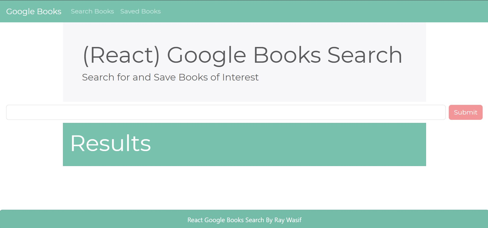
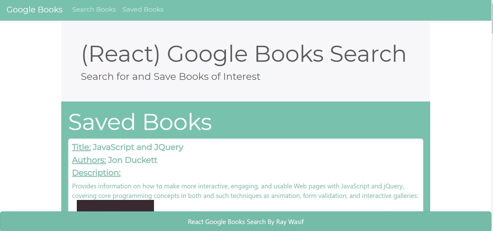

# React-Google-Books-Search
## Overview:

Google Books Search app, one page MERN stack app allows users to search for books throw Google Books APIs and save them to MongoDB.

## Technologies Used:
- React
- React Router
- MangoDB Atlas
- Express
- Node.js
- ES6
- Google Books APIs
- Bootstrap

- NPM Packages Used:
    * React
    * Shuffle-array
    * Concurrently
    * body-parser
    * mongoose
    * axios

## Author:

- <strong>Ray Wasif</strong>

## [Click Here to Try the App](https://google-books-search-with-react.herokuapp.com/)

## Screenshots:
- Search Books Page

- Saved Books Page
